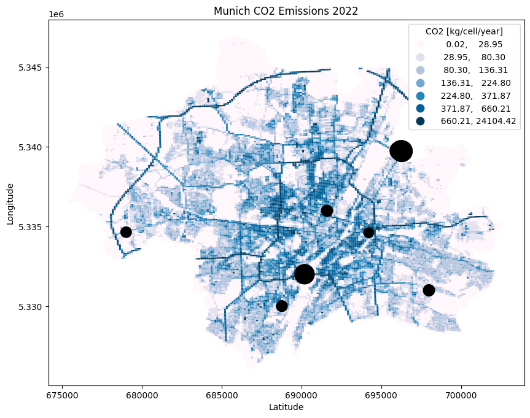

# Munich Emission Inventory

> **Summary**  
> Emission inventory with high spatial resolution for the City of Munich for the years of 2019-2022. The inventory is a combined product of bottom-up estimates based on local data (For Sector A, C, F, Human Resp.) developed by TUM and a spatially downscaled regional inventory for the remaining sectors provided by TNO.

---

## Introduction
The City of Munich (Landeshauptstadt München, LHM), located in the South East of Germany, spans 310.7 km2. With a population of over 1.5 Million, it is the third largest city in Germany. Due to its importance to the economy and good living conditions, the population is expected to grow to 1.8 Million by 2040. Munich plans to become climate-neutral by 2035. 
The City of Munich publishes total yearly CO2 emissions based on the BISKO methodology (Bilanzierungs-Systematik Kommunal). The latest report is from 2022 and lists emissions from 1990 to 2019. In addition, a spatial inventory is available from the German Environmental Agency (Umweltbundesamt, UBA) and the Netherlands Organisation for Applied Scientific Research (Nederlandse Organisatie voor Toegepast Natuurwetenschappelijk Onderzoek, TNO) with a spatial resolution of 1x1 km2. and 1/60° x 1/120° respectively. Both inventories combine spatially disaggregated bottom-up estimates and point sources with exact locations for some sectors with proxy-based downscaling of national emissions for the remaining ones. However, none of the available spatial emission inventories satisfies the project requirements. 
The sectors of public power, stationary combustion, road transport, and human respiration, which contain over 90% of Munich’s CO2 emissions, are created by a bottom-up approach using local data. Based on the resulting street- and building-resolution product, a gridded 100x100 m2 product was exported. The remaining sectors are based on downscaling the TNO-GHGco V4.1 emission inventory from 1x1 km2 to 100x100 m2. 
Deliverable 1.2 for Munich provides a gridded emission inventory for the years of 2019 to 2022 with a spatial resolution of 1/600° x 1/1200° (about 100x100 m2). A summary of the characteristics of this emission inventory and the methodology for each sector is included in Table 4. An executive summary of the methodology can be found in section 4.1. Figure 1 shows the gridded product and point sources within the administrative boundary of the City of Munich. Densely built-up areas and streets are clearly discernible.
   

## Methodology
### GNFR A - Public Power

Public power and district heating in Munich is provided through combined heat and power plants (CHP) and heating plants (HP). While the CHP North burns coal, waste, and sewage sludge, the other plants are primarily powered by natural gas. Over the next decades, Munich plans to slowly extend its renewable energy production through geothermal energy. 
The main input for this sector is the yearly environmental report of the local Municipality Works Company (Stadtwerke München, SWM) and the shared information for chimney locations and height. The provided 3D point sources pinpoint the exhaust entry into the atmosphere. A quality check for the SWM-reported 2019 emissionswas performed based on internal shared hourly fuel consumption, fuel composition, and calculated emission factors for all CHP/HP plants in Munich. Based on these results, the emissions from 2019 - 2022 are extracted directly from public reports. 

### GNFR B - Industry
Overall, Munich doesn’t have an energy-heavy industry within its city borders. Most industry-related emissions can be connected to the heating of working spaces. While we have information on total industry-related gas consumption, we can’t separate these into process and heating-related shares. Therefore, industry-related emissions are bundled into the stationary combustion GNFR C sector. 

### GNFR C - Stationary Combustion
Munich buildings are primarily heated by natural gas, light heating oil, or district heating. The total emissions of this sector are calculated by the yearly natural gas and oil consumption. We received the yearly numbers for total natural gas consumption of 2019-2022 and a split into residential, commercial, and industrial directly from SWM. The total oil consumption is extracted from the yearly emission report (2022) of the City of Munich. Unfortunately, starting from 2019 the data source changed and LHM is reporting a high uncertainty on the oil consumption. The latest consumption information is available for 2019. Oil consumption for 2020 – 2022 is extrapolated with a factor based on the gas consumption numbers of these years. 
The yearly sectoral emissions from gas and oil consumption are distributed by heating type, sectoral attribution, and heat demand calculated from building features. These building features are derived by joining different geospatial datasets provided by contacts from LHM, SWM, and a Bavarian ministry (Landesamt für Breitband, Digitalisierung und Vermessung, LBDV). The calculated heat demand serves as a proxy for energy distribution and is quality-checked versus a norm-based heat demand building model available for a subset of residential buildings. 

### GNFR F - Road Transport
Emissions from the road transport sectors were modeled based on the official macroscopic traffic model of the city of Munich, data from more than 100 traffic counting stations and HBEFA (Handbook Emission Factors of Road Transport) emission factors. The counting data was provided by the city of Munich and BASt (Bundesanstalt für Straßenwesen, eng.: Federal Highway Institute). 
The traffic model provides information on the average daily traffic volume during weekdays outside vacation time. The analysis year is 2019. Traffic counting data was used to scale the traffic model temporally and achieve a temporal resolution of 1 hour for the years of 2019, 2020, 2021, and 2022. Additionally, the congestion state was estimated based on the volume capacity ratio of each road link within the city area. Cold start excess emissions were calculated based on the number of vehicle starts in the traffic model. 
It's worth noting that while the analysis encapsulated a wide array of factors, public transport and tunnels were intentionally excluded from consideration. Additionally, though congestion levels were estimated, the exact precision of this estimation may vary due to the inherent complexities of traffic dynamics.

### Human Respiration 
CO2 from Human respiration is separated into three sectors: "indoor residential," "indoor non-residential," and "outdoor." The total population, commuters, and tourist numbers are extracted from statistical data. Based on geospatial information, a split between residential, commercial, and recreational areas is generated. Population density for subdistricts and building data are used to locate emissions in residential areas. The 2022 Time Use Survey (Zeitverwendungserhebung, ZVE) from the German Federal Statistical Office allocates the amount of time spent at different locations. Based on Google Reviews, the popularity of outdoor locations is estimated to distribute outdoor activity.

### Other Sectors
The remaining sectors were provided by TNO and were downscaled to 1/600° x 1/1200°. The data is based on TNO-GHGco V4.1. 

## Temporal Profiles
Temporal profiles for different sectors based on local data can be found in respective folders of [01_input_data](01_input_data).

## Characteristics of the City Emission Inventory of Munich

|Sector|Origin of data|Methodology (indicative)|
|:----|:----|:----|
|A - Public Power |Point sources|All powerplants and combined heat and powerplants (CHP) are operated by the city utity company (SWM) which publishes their emissions annualy. Emissions were verified based on input data provided by SWM and allocated to the exact point source.|
|B – Industry|-|No emission-intense industry within the municipal boundaries. Office and work-place heating of industrial areas is included in GNFR C.|
|C - Other stationary combustion|Bottom-up city data|Energy demand estimate per building to distribute reported annual energy consumption per sector and fuel type based on a block-level energy utilization plan. Spatial resolution: individual building level|
|D - Fugitives|National downscaled.|TNO-GHGco inventory V4.1 inventory at 1x1 km|
|E - Solvents & product use|National downscaled|TNO-GHGco inventory V4.1 inventory at 1x1 km|
|F - Road transport|Bottom-up city data|Based on local, macroscopic traffic model, traffic counting data from the local and national authorities and national statistics. Spatial distribution: Line sources based on street network|
|G - Shipping|-|Not occurring|
|H - Aviation|National downscaled|TNO-GHGco inventory V4.1 inventory at 1x1 km|
|I - Off Road (railways)|National downscaled|TNO-GHGco inventory V4.1 inventory at 1x1 km|
|I - Off Road (mobile machinery)|National downscaled|Downscaled TNO-GHGco inventory V4.1 inventory to 100x100 meter using ESA WorldCover "arable land" land use type (for the agriculture/forestry sector), using combination of CORINE "Industrial_or_commercial_units" and ESA WorldCover "built-up" land use types (for the construction, industr and commercial sector), and using population from Human Settlement Layer (for the residential sector).|
|J - Waste|National downscaled|Point sources at exact location; Remainder TNO-GHGco inventory V4.0 inventory at 1x1 km|
|K - AgriLivestock|-|Downscaled TNO-GHGco inventory V4.1 inventory to 100x100 meter using a combination of CORINE "Pastures" and ESA WorldCover "grassland" land use types.|
|L - AgriOther|National downscaled|Downscaled TNO-GHGco inventory V4.1 inventory to 100x100 meter using ESA WorldCover "arable land” land use type.|
|Other| |Not included|
|HR – Human Respiration|Bottom-up city data|Based on statistical numbers of total population, commuters, and tourists in the city of Munich.|

